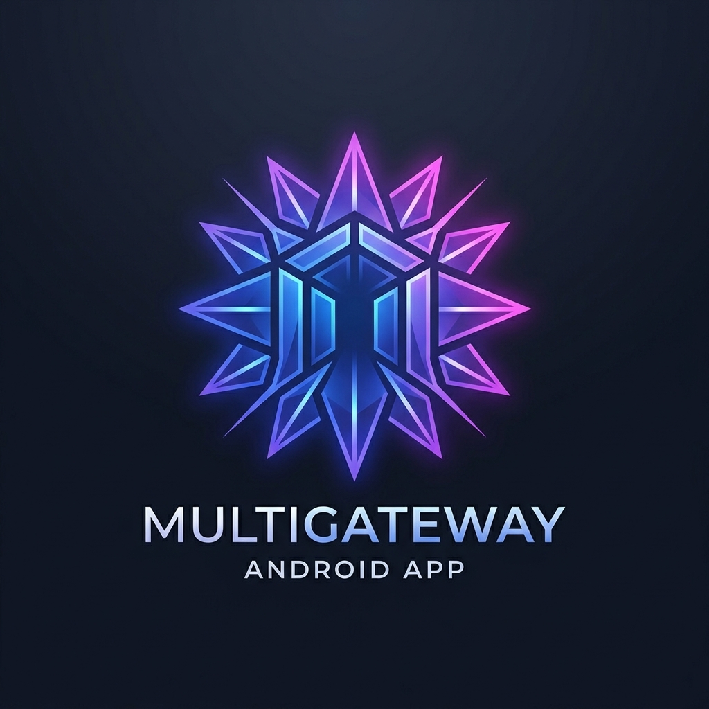

<p align="center">
  
</p>

# MultiGateway

MultiGateway is a native Android client for chatting with multiple AI providers from one app. It is built with Kotlin and Jetpack Compose and supports provider-specific configuration, per-model settings, MCP tools, media generation tools, profiles, local conversation storage, and speech features.

> **Status:** MultiGateway is under active development. APIs, database schemas, and UI behavior may still change between revisions.

## Features

- **Multiple LLM providers** — OpenAI/OpenAI-compatible, Anthropic, Google Gemini, and Ollama.
- **Account providers** — ChatGPT Codex, Claude Code, Google Antigravity, and GitHub Copilot with browser authorization and encrypted local credentials.
- **Custom endpoints** — configure custom base URLs, authentication, headers, and model catalogs for compatible gateways.
- **Per-model configuration** — model type, temperature, top-p/top-k, capabilities, tool support, reasoning/vision flags, and streaming overrides.
- **Streaming chat** — provider-level streaming defaults with optional per-model overrides.
- **MCP integration** — connect remote Model Context Protocol servers over Streamable HTTP and legacy SSE transports.
- **Native tool calling** — MCP and system tools are exposed as structured model tools instead of executable text embedded in responses.
- **Image and video generation tools** — generated media can be downloaded or decoded from base64 and stored locally instead of being inserted into chat as raw data.
- **Tool activity UI** — chat shows compact tool status/results while large outputs are stored separately to avoid flooding the conversation UI.
- **Local tool storage** — inspect, open, export, and manage files produced by tools.
- **Profiles** — reusable chat profiles with a system prompt and tool/MCP access configuration.
- **Conversation history** — conversations and configuration are persisted locally with Room.
- **Speech support** — speech service configuration plus Android text-to-speech integration.
- **Edge-to-edge Compose UI** — native Android interface designed around Material 3.

## Provider Configuration

MultiGateway separates settings by scope:

- **Provider settings:** endpoint, authentication, headers, maximum output tokens, model catalog, and default streaming behavior.
- **Model settings:** sampling parameters, model type/capabilities, tool support, and optional streaming override.
- **Profile settings:** system prompt and profile-specific tool/MCP access.

A model-level streaming setting takes precedence over the provider default. Leaving the model setting unset makes it inherit the provider setting.

### Account authorization

Select Codex, Claude Code, Antigravity, or GitHub Copilot in Provider settings and use the OAuth sign-in button. Codex, Claude Code, and Antigravity return to a localhost callback on the same Android device. Copilot copies a device code to the clipboard; paste it into the GitHub verification page. Credentials are stored with Android Keystore encryption, scoped to the provider ID; exported configuration contains only an authorization marker. Sign in again after importing configuration on another device.

Antigravity provisions the account's Code Assist project and maps canonical model names to backend routes. Copilot discovers available models and selects the appropriate Chat Completions, Responses, or Anthropic protocol. All account providers share the chat/tool dispatch used by Codex, including streaming overrides.

Antigravity uses the native-app OAuth client defaults from the protocol reference; no additional build secrets or separate OAuth application are required.

Protocol reference: [smallmain/vscode-unify-chat-provider](https://github.com/smallmain/vscode-unify-chat-provider), especially its auth providers and Claude Code, Code Assist, and Copilot clients.

## MCP

MultiGateway supports remote MCP servers using:

- Streamable HTTP
- Legacy HTTP + SSE

STDIO transport is intentionally not exposed because MultiGateway is an Android client and does not host arbitrary local MCP processes.

MCP tools can be enabled or disabled per server/tool. Tool output shown in chat is bounded, while larger results can be persisted as files.

## System Media Tools

Image and video generation can be configured as system tools and assigned to compatible provider models.

Media responses may be returned as URLs or base64 data. MultiGateway stores generated media as local files and references those files from the chat/tool UI rather than persisting large base64 payloads inside conversations.

## Platform Support

- [x] Android
- [ ] iOS
- [ ] Web
- [ ] Windows
- [ ] macOS
- [ ] Linux

The current codebase is Android-native and no longer uses the previous Flutter implementation.

## Building from Source

### Requirements

- JDK 17
- Android SDK with API 34
- Android Studio or another Android development environment

The repository includes the Gradle wrapper, so a separate Gradle installation is not required.

### Build

```bash
git clone https://github.com/starfall-orb/multigateway.git
cd multigateway

# Debug APK
./gradlew assembleDebug

# Unit tests
./gradlew test
```

On Windows, use `gradlew.bat` instead of `./gradlew`.

## Project Structure

```text
app/src/main/java/org/starfall/multigateway/
├── di/              # Application dependency container and ViewModel factories
├── data/
│   ├── local/        # Room database, preferences, local security helpers
│   ├── model/        # Provider, model, MCP, profile and tool models
│   ├── repository/   # Persistence repositories
│   ├── service/      # LLM, MCP and speech services
│   └── tools/        # Tool runtime, media generation and file handling
└── ui/
    ├── chat/         # Chat UI, ViewModel and generation lifecycle
    ├── configuration/ # Provider/profile/MCP/speech mutations
    ├── navigation/   # Navigation Compose destinations
    ├── drawer/       # Conversation navigation
    ├── mcp/          # MCP server configuration
    ├── profiles/     # Chat profiles
    ├── providers/    # Provider and model configuration
    ├── settings/     # Settings UI and ViewModel
    ├── speech/       # Speech configuration
    └── tools/        # System tool and storage screens
```

See [Android architecture](docs/architecture.md) for dependency ownership, state lifetimes,
and navigation behavior. Raw assets live in `app/src/main/assets/`; Android resources
live in `app/src/main/res/`.

## Security Notes

Provider credentials and MCP authorization data are sensitive. Avoid committing real API keys or authorization headers to the repository. Prefer HTTPS for remote providers and MCP servers; plain HTTP should only be used where it is intentionally required, such as trusted local development endpoints.

## Contributing

Contributions are welcome. See [CONTRIBUTING.md](CONTRIBUTING.md) for repository guidelines.

## License

[](https://raw.githubusercontent.com/starfall-orb/multigateway/refs/heads/main/LICENSE)

This project is licensed under the **Starfall Orb Contributor Commercial Copyleft License v1.0**. See the [LICENSE](https://raw.githubusercontent.com/starfall-orb/multigateway/refs/heads/main/LICENSE) file for details.
